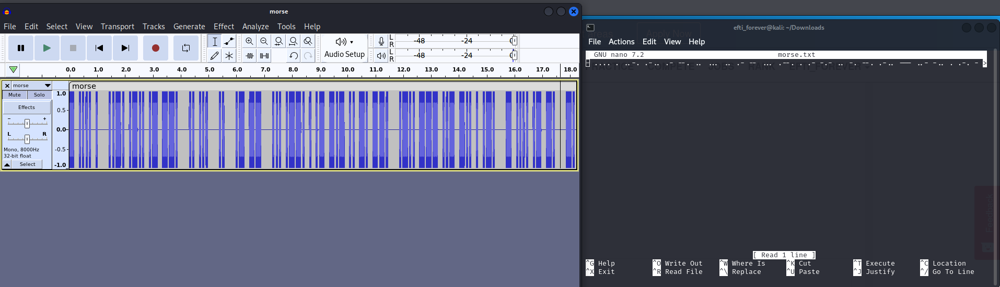

# LOUDER Cybertalents Problem

__Problem Link:__ [LOUDER](https://cybertalents.com/challenges/cryptography/louder)
---

__Description:__ Can you decode the wired sounds? 

Flag format: flag{X XX XXXXXXXX XXXXXX XXXX XXXXXX}  
https://hubchallenges.s3-eu-west-1.amazonaws.com/Crypto/morse.wav  
`If the link does not work, use vpn or wget in kali`

### My Approach:

1. First I install audacity in my kali.
2. Open the downloaded `morse.wav` file in audacity application.
3. As convention, we know the low sound means dot(.) and the long sound means dash(-) and long gap means space( ).
4. So, I just use the technique and take the note of the code and put in the [morse deocder](https://morsecode.world/international/translator.html)
5. That is the flag now just put it in the mentioned way.
6. 

### flag : ~~flag{I AM SPEAKING LOUDER THAN BEFORE}~~
_Note:_ Don't copy it try yourself.